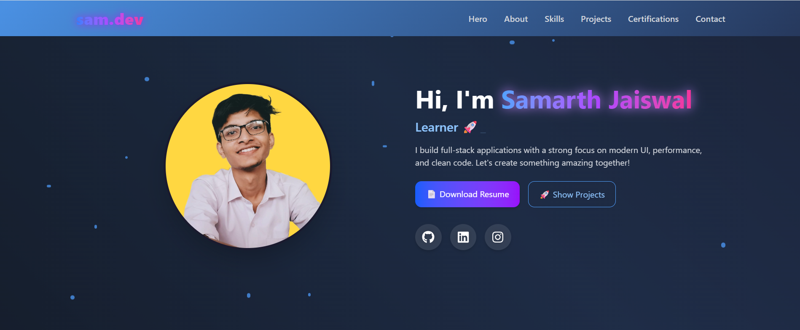
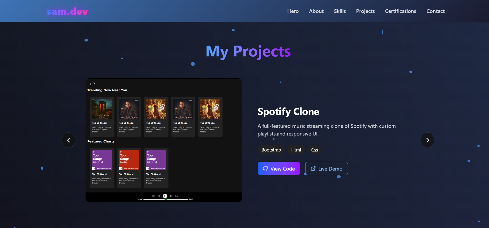

<h1 align="center">🌟 Personal Portfolio</h1>

  
  
  

---
## 🌍 Live Demo

🧑‍💻 **Check it Live Here**:  
🔗 [https://your-portfolio.vercel.app](https://your-portfolio.vercel.app)  

---

## 🖥️ Project Overview

This is a **Personal Portfolio Web App** designed to showcase my projects, skills, and professional journey. It features a modern, user-friendly interface with a clean design inspired by contemporary portfolio websites. Key elements include:

- Professional hero section with an introduction
- Project showcase with interactive cards
- Skills section highlighting technical expertise
- Contact form and social media links
- Smooth animations and hover effects

---

## 🚀 Features

- 💼 **Projects Section** with modal previews and tech stack filters
- 📜 **Resume & Experience Timeline** with smooth animations
- 🧠 **Skills Section** with tech icons and grid layout
- 🧾 **Certifications** display with certificate thumbnails
- ✉️ **Contact Form** powered by **EmailJS**
- 💡 **Hero Section** with typewriter effect and animated background
- 🧊 **Glassmorphism**, gradient texts, and animated particles
- 🌐 Fully **Responsive Design** for all devices

---

## 🛠️ Tools & Technologies Used

  
  
  
  

---

## 📸 Screenshots

  
  

---

## 🚀 Getting Started Locally
Follow these steps to run the project locally on your machine:

### 1️⃣ Clone the Repository
git clone https://github.com/samjaiswal51/portfolio.git

### 2️⃣ Navigate to the Project Folder
cd portfolio

### 3️⃣ Install Dependencies
Make sure you have Node.js installed. Then run:
npm install

### 4️⃣ Start the Development Server
npm run dev

---

## 📌 Note
🧪 This project is a frontend-only portfolio built to practice and demonstrate my skills in web development. It focuses on UI/UX design using React, TailwindCSS, and JavaScript, without backend functionalities or APIs.

---

## 🙌 Connect with Me
Feel free to explore the code, provide feedback, or reach out for collaboration!  

   

---

#### ⚠️ This project is continuously evolving. Feel free to fork, suggest changes, or contribute!
